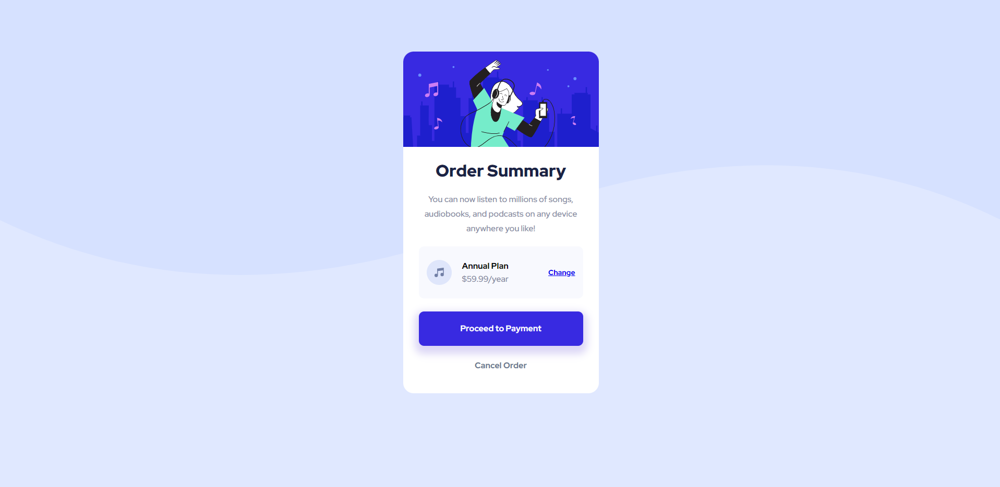
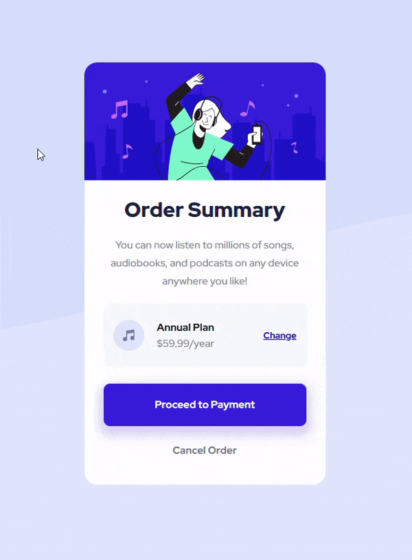

# Frontend Mentor - Order summary card solution

This is a solution to the [Order summary card challenge on Frontend Mentor](https://www.frontendmentor.io/challenges/order-summary-component-QlPmajDUj). Frontend Mentor challenges help you improve your coding skills by building realistic projects. 

## Table of contents

- [Overview](#overview)
  - [The challenge](#the-challenge)
  - [Screenshot](#screenshot)
  - [Links](#links)
- [My process](#my-process)
  - [Built with](#built-with)
  - [Useful resources](#useful-resources)
- [Author](#author)

## Overview

As a beginner in Front-end field, I started with basic materials to complete this challenge. I feel really satisfied with the result but there must a long run forward.   
So I hope to be better through every challenges that I have taken. 
### The challenge

Users should be able to:

- See hover states for interactive elements

### Screenshot

- For Mobile
 

- For Desktop 

- Hover states for interactive elements

### Links

- Solution URL: [Github](https://github.com/anhhuynh1506/Order-summary-component.git)
- Live site URL: [Live site URL](https://anhhuynh1506.github.io/Order-summary-component/)

## My process

### Built with

- Semantic HTML5 markup
- CSS custom properties
- Flexbox
- Mobile-first workflow

### Useful resources

- [w3schools](https://www.w3schools.com/css/)
- [MDN](https://developer.mozilla.org/) 

These two webside are to learn every basic knowledge to build this card challenge.

- [The Web Developer Bootcamp 2022 Course](https://www.udemy.com/course/the-web-developer-bootcamp/) in Udemy. I'm halfway done.

## Author

- Github - [Nguyễn Huỳnh Anh](https://github.com/anhhuynh1506)
- Frontend Mentor - [@anhhuynh1506](https://www.frontendmentor.io/profile/anhhuynh1506)

